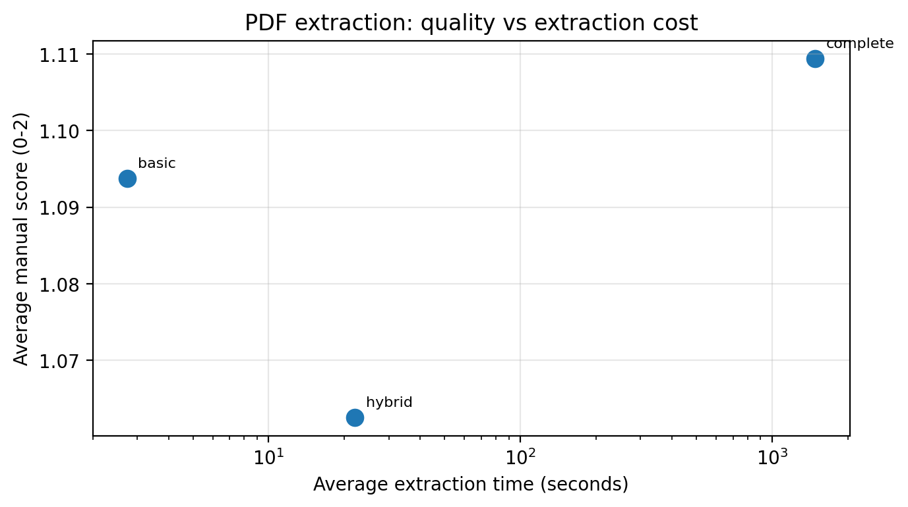
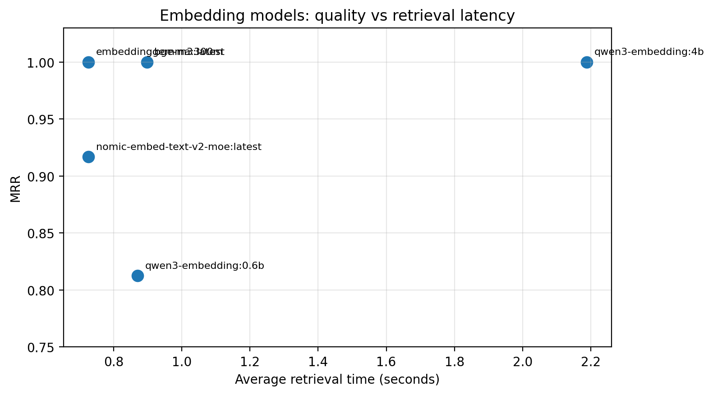
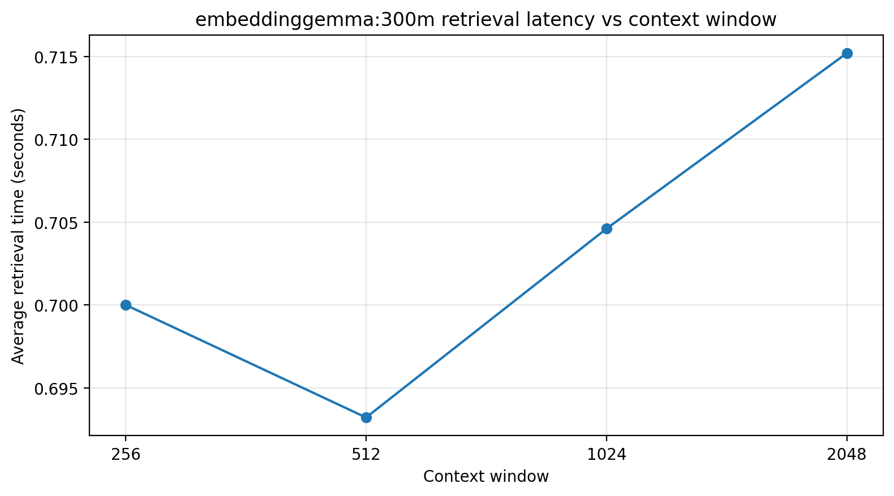
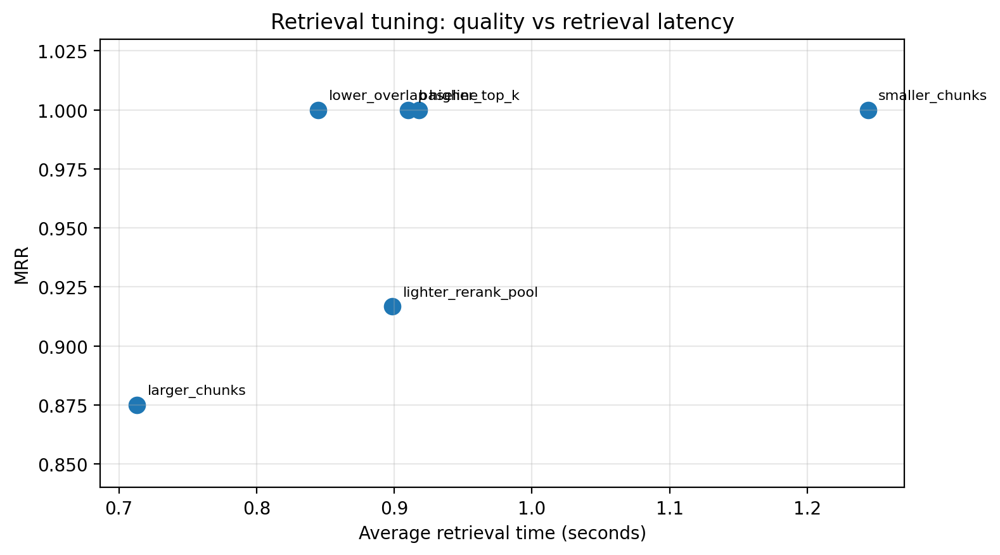
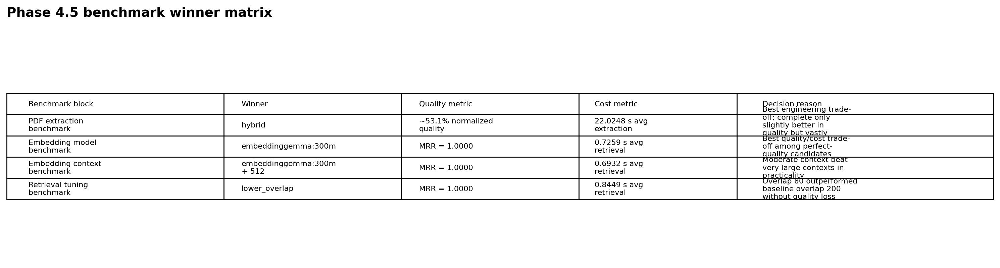

# AI Workbench Local

Plataforma de IA aplicada para experimentar **LLMs locais**, conversar com documentos, comparar estratégias de ingestão e retrieval, avaliar respostas e evoluir um pipeline de **RAG robusto, explicável e orientado a portfólio**.

---

## Objetivo

Este projeto está sendo evoluído para se tornar um ativo forte de portfólio, demonstrando aplicação prática de IA com foco em:

- chat com modelos locais
- RAG com documentos
- extração robusta de PDFs
- outputs estruturados
- benchmarking, avaliação e observabilidade
- experimentação controlada de arquitetura

---

## Casos de uso principais

1. **Chat com documentos (RAG)**
2. **Assistente de código**
3. **Extração estruturada de informação**
4. **Benchmark de estratégias de parsing e retrieval**

---

## Stack principal

- Python
- Streamlit
- Ollama
- OpenAI-compatible API
- LangChain
- LangGraph
- Chroma
- SQLite
- Pydantic
- PyPDF
- Docling
- Matplotlib

---

## Arquivos principais neste momento

- `main_qwen.py` → app principal local com Ollama
- `main.py` → versão configurável para provider compatível com OpenAI
- `proximos_passos.md` → roadmap oficial do projeto
- `scripts/run_all_phase_4_5_benchmarks.py` → orquestrador completo dos 4 benchmarks da Fase 4.5
- `scripts/run_phase_4_5_benchmark_suite.py` → suíte de embeddings, embedding context window e retrieval tuning
- `scripts/run_pdf_extraction_benchmark_en.py` → benchmark automatizado dos modos de extração de PDF
- `scripts/render_phase_4_5_charts.py` → renderização reprodutível dos gráficos da Fase 4.5
- `docs/PHASE_4_5_BENCHMARK_RESULTS.md` → resultados completos com tabelas, gráficos e decisões
- `docs/PHASE_4_5_VALIDATION.md` → fechamento técnico e operacional da Fase 4.5
- `docs/BENCHMARK_PDF_EXTRACTION_en.md` → benchmark detalhado de extração de PDF

---

## Estrutura atual do projeto

```text
src/
  config.py
  prompt_profiles.py
  providers/
  rag/
  services/
  storage/
  ui/

scripts/
  run_all_phase_4_5_benchmarks.py
  run_phase_4_5_benchmark_suite.py
  run_pdf_extraction_benchmark.py
  run_pdf_extraction_benchmark_en.py
  run_embedding_benchmark.py
  render_phase_4_5_charts.py
  compare_phase_4_5_configs.py
  validate_phase_4_5.py

docs/
  BENCHMARK_PDF_EXTRACTION_en.md
  PHASE_3_NOTES.md
  PHASE_4_NOTES.md
  PHASE_4_5_BENCHMARK_RESULTS.md
  PHASE_4_5_VALIDATION.md
  PUBLICATION_GUIDE.md
  assets/
    phase_4_5/
  data/
    phase_4_5_benchmark_data.json
```

---

## Como rodar localmente

### 1. Instale as dependências

```bash
pip install -r requirements.txt
```

### 2. Revise o arquivo `.env`

Se precisar recriar do zero:

```bash
cp .env.example .env
```

### 3. Garanta que o Ollama esteja disponível

Exemplo de modelos locais:

- geração: `qwen2.5:7b`
- embeddings: modelo configurado no `.env`

### 4. Execute a versão principal

```bash
streamlit run main_qwen.py
```

O app principal mantém:

- `ollama` como provider default
- `huggingface_server` como provider opcional para apontar para um endpoint OpenAI-compatible, como o `hf_local_llm_service`

### 4.1 Usar o `hf_local_llm_service` como AI hub opcional

No `.env`, configure por exemplo:

```env
HUGGINGFACE_SERVER_BASE_URL=http://127.0.0.1:8788/v1
HUGGINGFACE_SERVER_MODEL=
HUGGINGFACE_SERVER_EMBEDDING_MODEL=
```

Depois, no app principal (`main_qwen.py`):

- mantenha `ollama` como default para o fluxo atual
- selecione `huggingface_server` quando quiser usar o serviço como hub multi-provider

Importante:

- os modelos mostrados em `huggingface_server` são aliases publicados pelo serviço
- o backend real por trás do alias pode ser `ollama`, `huggingface_local`, `huggingface_mlx`, `llama.cpp`, `openai`, etc.
- para RAG com `huggingface_server`, o serviço precisa publicar pelo menos um alias com suporte a embeddings
- `huggingface_server` só aparece na seção de embeddings quando o serviço publicar aliases com `supports_embeddings=true`
- `huggingface_inference` só aparece na seção de embeddings quando `HUGGINGFACE_INFERENCE_EMBEDDING_MODEL` estiver configurado

### 4.1.1 Overrides operacionais do app vs comportamento backend-native

Hoje o app diferencia dois grupos:

- **operacionais do app**: `temperature`, `context_window`, `embedding_context_window`, `truncate`, além de `top_p` e `max_tokens` quando configurados por ambiente
- **backend-native**: a forma como cada runtime realmente interpreta esses valores

Na prática:

- `ollama` recebe `temperature`, `num_ctx`, `top_p` e `num_predict` no caminho nativo de chat, e `truncate` + `num_ctx` em embeddings
- `huggingface_server` recebe esses mesmos sinais operacionais via `provider_config` (`temperature`, `ctx_size`, `top_p`, `max_tokens`, `truncate`), mas a aplicação efetiva ainda depende do hub/servidor por trás do alias
- `huggingface_inference` e `openai` aceitam `temperature`, `top_p` e `max_tokens` quando configurados, mas não expõem um equivalente universal a `num_ctx`

### 4.2 Controles operacionais expostos na sidebar

Além de geração e embeddings, a sidebar do app principal agora também expõe:

- parâmetros de reranking híbrido (`rerank_pool_size`, `rerank_lexical_weight`)
- backend OCR documental (`EVIDENCE_OCR_BACKEND`)
- modelo VLM documental (`EVIDENCE_VL_MODEL`)

Esses controles ajudam a separar melhor:

- geração
- embeddings
- retrieval/reranking
- parsing documental / OCR / vision

Além disso, a sidebar mostra explicitamente os providers de embedding indisponíveis como **desabilitados**, com o motivo operacional.

### 5. Execute a versão OpenAI-compatible (opcional)

Preencha `OPENAI_API_KEY` no `.env` e rode:

```bash
streamlit run main.py
```

---

## Modos de extração de PDF

O projeto possui **3 modos explícitos de extração**, selecionáveis na interface e benchmarkados na Fase 4.5.

### 1. Básico

Usa somente `pypdf`.

Melhor para:
- PDFs textuais simples
- ingestão rápida
- comparação de baseline

### 2. Híbrido inteligente

Usa `pypdf` como baseline e aplica enriquecimento seletivo em páginas suspeitas com Docling/OCR.

Melhor para:
- apostilas
- papers com figuras e tabelas
- documentos mistos

### 3. Completo por página

Modo de cobertura máxima.

Melhor para:
- scans
- manuais antigos
- PDFs image-heavy
- testes de recall máximo

---

## Fase 4.5 concluída

A Fase 4.5 foi encerrada com **quatro trilhas de benchmark** executadas no mesmo corpus local de quatro PDFs, incluindo **revisão humana** para o benchmark de extração.

### Corpus e métricas usados

Corpus fixo da suíte:

- `2025-HB-44-20250106-Final-508.pdf`
- `kaur-2016-ijca-911367.pdf`
- `Meng_Extraction_of_Virtual_ICCV_2015_paper.pdf`
- `c9c938dc-08e0-4f18-bf1d-a5d513c93ed8.pdf`

Métricas usadas:

- **PDF extraction:** `manual_score` (0–2), tempo de extração e tempo de indexação
- **retrieval benchmarks:** `Hit@1`, `Hit@K`, `MRR`, `avg_retrieval_seconds`, `indexing_seconds`

### Configuração recomendada após a Fase 4.5

```env
OLLAMA_EMBEDDING_MODEL=embeddinggemma:300m
OLLAMA_EMBEDDING_CONTEXT_WINDOW=512
RAG_CHUNK_SIZE=1200
RAG_CHUNK_OVERLAP=80
RAG_TOP_K=4
RAG_RERANK_POOL_SIZE=8
RAG_PDF_EXTRACTION_MODE=hybrid
```

### Benchmark highlights

#### 1) PDF extraction: quality vs extraction cost



`complete` obteve a melhor qualidade média agregada (**1.1094**), mas exigiu **1485.38 s** de extração média, contra **22.0248 s** de `hybrid`. A diferença de qualidade foi pequena demais para justificar esse custo como default.

#### 2) Embedding models: quality vs retrieval latency



`embeddinggemma:300m` atingiu **MRR = 1.0** e ficou no melhor ponto de trade-off entre qualidade e latência entre os modelos perfeitos.

#### 3) Embedding context window: practical optimum



No trilho vencedor, `embeddinggemma:300m + 512` entregou **MRR = 1.0** com a menor latência média (**0.6932 s**). O benchmark mostrou que contexto maior não foi automaticamente melhor.

#### 4) Retrieval tuning: winner vs baseline



`lower_overlap` manteve **MRR = 1.0** e melhorou latência e indexação em relação ao baseline. Isso justificou a troca de `chunk_overlap=200` para `80` como default.

#### 5) Executive summary



A decisão final foi feita por **trade-off entre qualidade, custo e robustez**, não por score bruto isolado.

### Como regenerar os gráficos da Fase 4.5

```bash
python scripts/render_phase_4_5_charts.py
```

Os dados-base versionados usados na renderização estão em:

```text
docs/data/phase_4_5_benchmark_data.json
```

Para a análise completa, veja:
- `docs/PHASE_4_5_BENCHMARK_RESULTS.md`
- `docs/PHASE_4_5_VALIDATION.md`
- `docs/BENCHMARK_PDF_EXTRACTION_en.md`

---

## Fase 5.5 concluída tecnicamente

A Fase 5.5 consolidou a transição do projeto de um pipeline puramente manual para uma arquitetura híbrida, auditável e mais próxima da stack de mercado.

### O que foi entregue na prática

- estratégias experimentais de **loader**, **chunking** e **retrieval** com fallback seguro
- comparação shadow entre retrieval manual e LangChain + Chroma
- workflow experimental **LangGraph** para execução estruturada com retry de contexto e guardrails
- comparação shadow entre `direct` e `langgraph_context_retry`
- separação explícita entre **provider de geração** e **provider de embeddings**
- provider local experimental **`huggingface_local`**
- provider HTTP local **`huggingface_server`**
- provider remoto **`huggingface_inference`**
- helpers compartilhados para resolução de runtime multi-provider
- snapshot operacional consolidado para tornar a UI menos acoplada ao detalhe do runtime

Veja também:

- `docs/HUGGINGFACE_PROVIDER_SETUP.md` → configuração de `huggingface_server` e `huggingface_inference`
- `../hf_local_llm_service/docs/OLLAMA_DEFAULT_PLUS_HF_SERVICE_ROADMAP.md` → roadmap da convivência entre `ollama` default e `huggingface_server` opcional via AI hub local

### Leitura arquitetural da fase

O projeto agora deixa mais explícita a separação entre:

- geração
- embeddings
- reranking
- workflows estruturados
- runtime experimental local

Na prática, isso fecha a Fase 5.5 como uma fase de **evolução arquitetural controlada**, sem abandonar a baseline manual que dá sustentação à narrativa técnica do projeto.

---

## Próximo passo estratégico

Com a Fase 5.5 encerrada tecnicamente, o roadmap oficial segue para:

1. **Fase 6 — Tools e agentes orientados a valor de negócio**
2. **Fase 7 — Benchmark e comparação entre modelos**
3. **Fase 8 — Evals**

---

## Valor de portfólio

Este projeto não foi fechado como “um chatbot com RAG”. A Fase 4.5 consolidou o repositório como um artefato de portfólio de **AI Engineer**, mostrando:

- benchmark de ingestão com validação humana
- benchmark de representação vetorial
- benchmark de tuning de contexto de embedding
- benchmark de retrieval tuning
- defaults finais escolhidos por evidência
- assets visuais e script reprodutível de benchmark

Isso aumenta a auditabilidade do projeto e facilita defender as decisões técnicas em entrevista.
