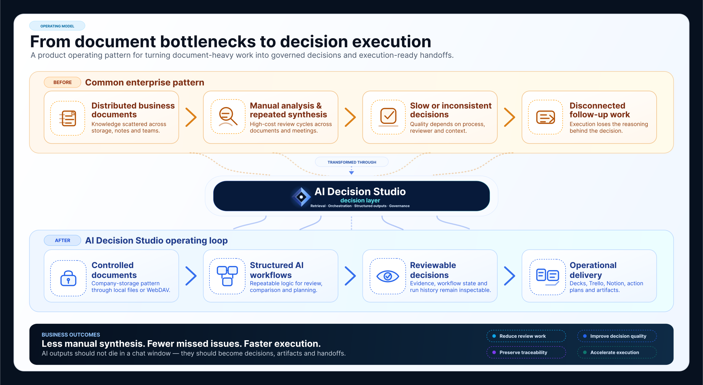
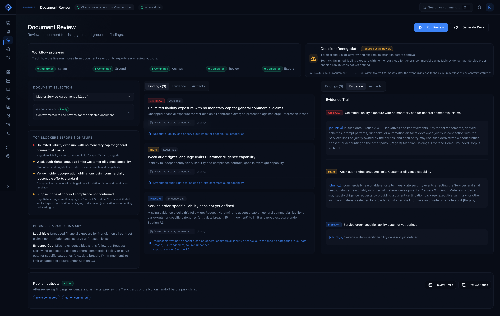
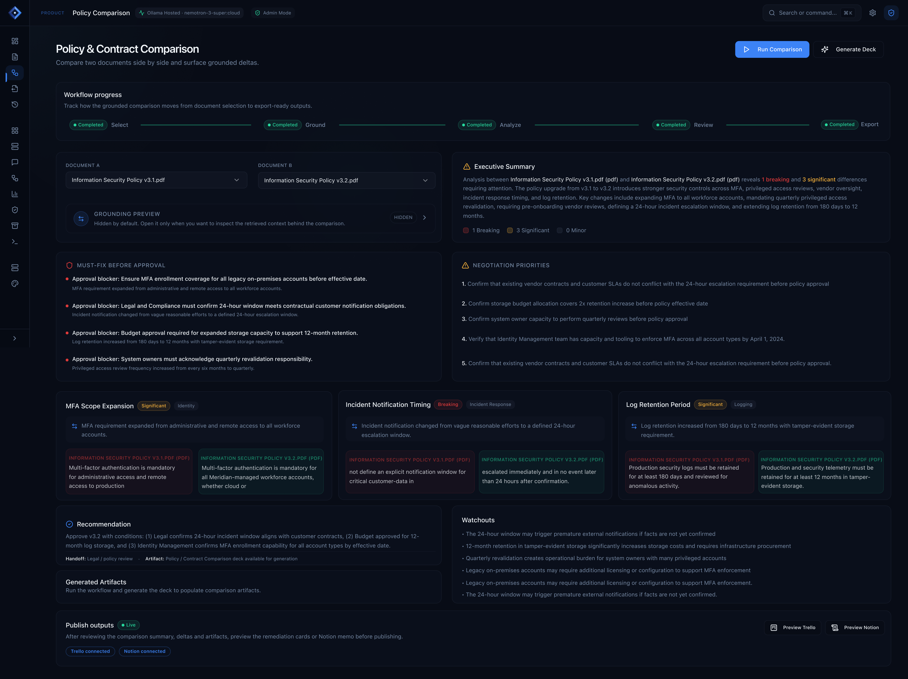
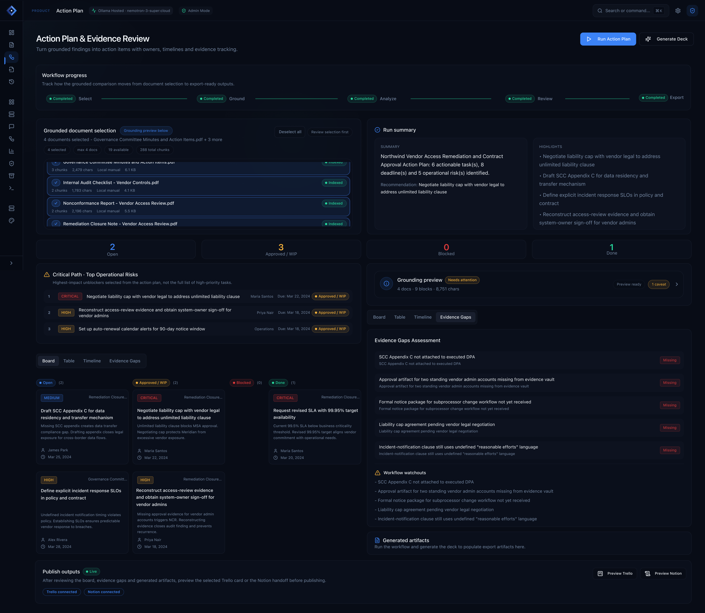
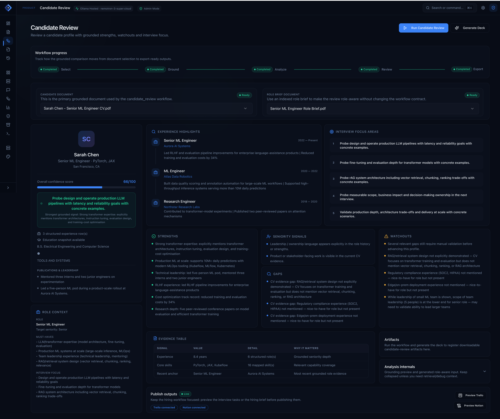
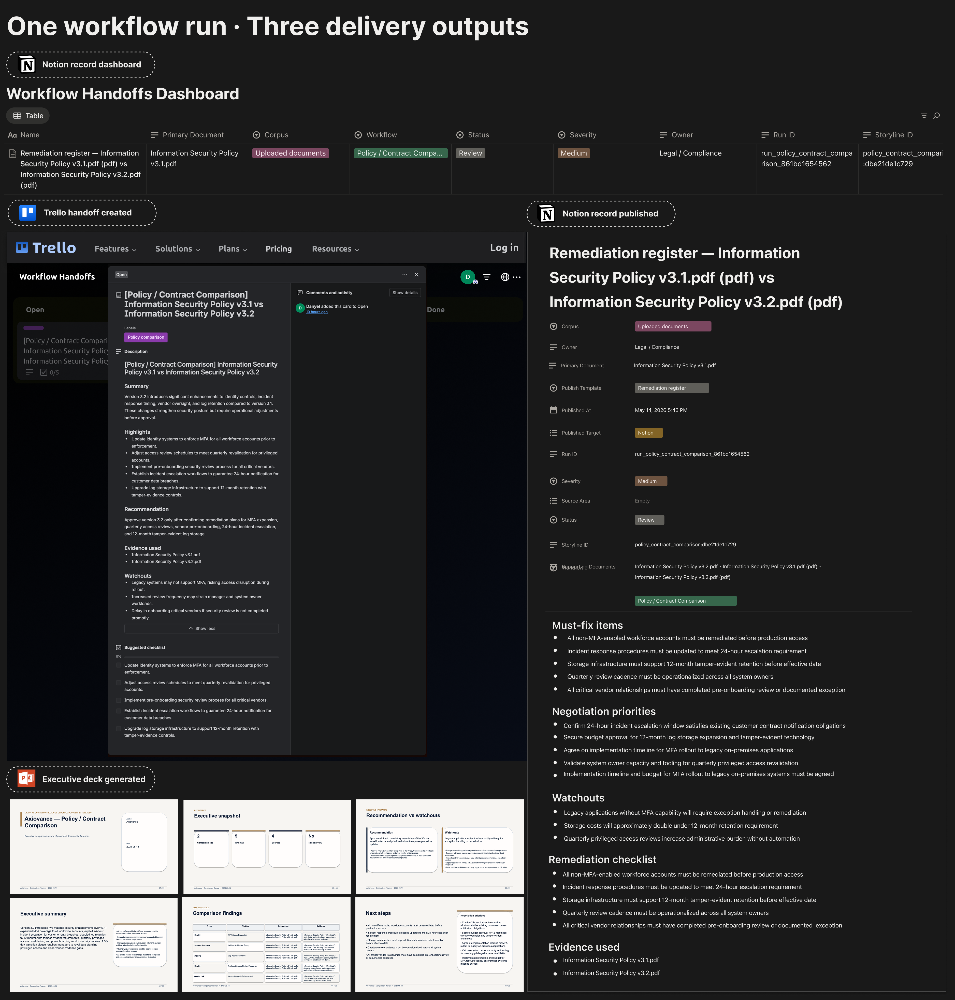

<p align="center">
  
</p>

<p align="center">
  <a href="https://github.com/danyellambert/Axiovance/actions/workflows/product-ci.yml"></a>
  <a href="https://github.com/danyellambert/Axiovance/actions/workflows/deploy-aws.yml"></a>
</p>

<p align="center">
  
  
  
  
  
  
  
  
  
  <a href="LICENSE">
    
  </a>
</p>

<!-- If the public GitHub repository slug changes, update the Product CI badge URLs above. -->

<h1 align="center">Axiovance</h1>

<p align="center">
  <strong>AI workflows that turn enterprise documents into decisions teams can trust, defend and execute.</strong>
</p>

<p align="center">
  Axiovance helps organizations turn contracts, policies, reports, CVs and internal documents into traceable decisions, executive artifacts and operational handoffs.
</p>  

<p align="center">
  <a href="https://axiovance.danyel-lambert.com/github"><strong>Live Product</strong></a>
  ·
  <a href="https://axiovance.danyel-lambert.com/github-tour"><strong>Guided Tour</strong></a>
  ·
  <a href="#why-it-matters">Why it matters</a>
  ·
  <a href="#workflow-showcase">Workflows</a>
  ·
  <a href="#architecture">Architecture</a>
  ·
  <a href="#quickstart">Run Locally</a>
</p>

<p align="center">
  
</p>

> AI outputs should not die in a chat window. They should become decisions, artifacts and execution.

Axiovance connects business documents to structured AI workflows, helping teams reduce manual review work, improve decision quality and move faster from analysis to execution.

It is designed as a product system, not a one-off prompt demo: documents are managed as workflow context, outputs are reviewable, decisions are traceable, artifacts are generated, and delivery actions can push results into execution tools.

---

## Guided product tour

The public product includes a guided tour from the landing page, so first-time visitors can understand the product flow before reading the code.

It walks through the operating model behind Axiovance: controlled documents, structured AI workflows, reviewable decisions, generated artifacts and operational handoffs.

<p align="center">
  <a href="https://axiovance.danyel-lambert.com/github-tour"><strong>Open the guided tour</strong></a>
</p>

---

## Contents

- [Guided product tour](#guided-product-tour)
- [Why it matters](#why-it-matters)
- [Built from real operating bottlenecks](#built-from-real-operating-bottlenecks)
- [From documents to execution](#from-documents-to-execution)
- [Built for high-leverage document work](#built-for-high-leverage-document-work)
- [Workflow showcase](#workflow-showcase)
- [Delivery & execution](#delivery--execution)
- [Trust, privacy and enterprise fit](#trust-privacy-and-enterprise-fit)
- [Architecture](#architecture)
- [AI Engineering Lab](#ai-engineering-lab)
- [Engineering depth](#engineering-depth)
- [Technology stack](#technology-stack)
- [Repository map](#repository-map)
- [Quickstart](#quickstart)
- [Validation](#validation)
- [API surface](#api-surface)
- [Further documentation](#further-documentation)
- [Name](#name)
- [License](#license)

---

## Why it matters

Enterprise teams already have the knowledge: contracts, policies, reports, procedures, candidate files, vendor documents and internal operating material.

The problem is that this knowledge is often trapped inside document repositories, manual reviews, meetings, spreadsheets and follow-up tools.

Axiovance compresses that path into a governed decision workflow: documents become findings, risks, gaps, recommendations, action plans, executive decks and operational handoffs.

| Business problem | Product outcome |
| --- | --- |
| Expensive teams spend hours reading and comparing documents | Structured findings, risks, gaps and recommendations |
| Critical issues are missed during manual review | Source-grounded, reviewable outputs |
| AI answers stay trapped in chat windows | Decks, Trello cards, Notion records and action plans |
| Decisions are hard to audit later | Run history, workflow state and artifact lineage |
| Sensitive documents live in company storage | Nextcloud/WebDAV simulates a private document cloud pattern |
| Teams work differently across functions | Repeatable workflows for review, comparison, planning and evaluation |

Axiovance is built for high-leverage document work where speed, traceability and control matter.

---

## Built from real operating bottlenecks

Axiovance was shaped by recurring problems I faced across strategy, growth operations, partnerships, process improvement, and business analysis work.

In document-heavy teams, valuable information is often spread across contracts, policies, reports, CRM notes, benchmarks, candidate files and internal procedures. Turning that material into decisions usually requires manual review, synthesis, follow-up meetings, spreadsheets, slide decks and execution tracking.

The product was built around that gap: compressing the path from business documents to structured decisions, executive artifacts and operational handoffs.

<p align="center">
  
</p>

---

## From documents to execution

Axiovance follows a simple operating loop:

1. **Connect** documents from local files or company-controlled storage.
2. **Analyze** them through structured AI workflows.
3. **Review** findings, gaps, risks, recommendations and supporting context.
4. **Decide** with traceable workflow history and artifact lineage.
5. **Deliver** outputs as decks, Trello cards, Notion records or action plans.

This makes the product useful beyond summarization. It creates a bridge between enterprise documents and business execution.

---

## Built for high-leverage document work

| Team | What Axiovance helps with |
| --- | --- |
| Strategy & consulting | Turn reports, market notes and client materials into recommendations, executive decks and action plans. |
| Legal & compliance | Compare policies, contracts and obligations with risk-oriented, reviewable outputs. |
| Procurement & operations | Convert vendor documents, requirements and internal procedures into priorities, gaps and execution plans. |
| HR & talent teams | Review candidates against role briefs with structured, evidence-based assessments. |
| AI & data teams | Evaluate model behavior, runtime choices and workflow quality through the AI Engineering Lab. |
| Executive teams | Move from private document repositories to decision-ready summaries, artifacts and handoffs. |

---

## Workflow showcase

The product is organized around repeatable workflows rather than a generic prompt box. Each workflow turns document context into a structured output that can be reviewed, reused and delivered.

### Document Review

<p align="center">
  
</p>

Turns long business documents into structured findings, gaps, risks and recommendations.

Useful for reports, internal policies, vendor material, operating procedures and strategic notes.

**Output signal:** executive summary, findings, gaps, risks, recommendations and source-aware review context.

---

### Policy / Contract Comparison

<p align="center">
  
</p>

Compares two documents and turns differences into decision-ready priorities, risks and negotiation points.

Useful for legal, compliance, procurement, vendor review and internal policy alignment.

**Output signal:** difference summary, must-fix items, business impact, watchouts and negotiation priorities.

---

### Action Plan

<p align="center">
  
</p>

Converts document findings into execution-ready tasks, priorities, owners and follow-up structure.

Useful for operations, PMO, consulting delivery and internal transformation work.

**Output signal:** action items, owners, priority, status, follow-up structure and delivery controls.

---

### Candidate Review

<p align="center">
  
</p>

Evaluates candidate evidence against a role brief and produces a structured, explainable assessment.

Useful for talent teams, hiring managers and AI-assisted screening workflows.

**Output signal:** role context, candidate strengths, gaps, concerns, recommendation and evidence-backed review notes.

---

## Delivery & execution

Axiovance does not stop at analysis.

Workflow outputs can become executive decks, Trello cards, Notion records and action plans - connecting AI-assisted review to the tools where teams actually execute work.

<p align="center">
  
</p>

| Delivery output | Why it matters |
| --- | --- |
| Executive decks | Turns analysis into a format that leaders can review, present and act on. |
| Trello cards | Converts findings into trackable operational work. |
| Notion records | Preserves structured workflow output in a team knowledge system. |
| Run history | Keeps decisions inspectable after the workflow runs. |
| Artifact lineage | Connects generated outputs back to workflow context. |

---

## Trust, privacy and enterprise fit

Axiovance was designed for workflows where documents are sensitive, decisions need to be reviewed and outputs must become operational.

The Nextcloud/WebDAV layer simulates a company-controlled document cloud pattern - similar to the way enterprises centralize documents in internal drives, SharePoint-like systems or private storage.

For privacy-sensitive workflows, the stack can be deployed with company-controlled storage and local model runtimes, helping teams keep document review and workflow execution inside a controlled environment.

This matters because enterprise AI workflows need more than fast answers:

- documents should come from controlled repositories;
- outputs should remain reviewable;
- decisions should be traceable;
- public demos should not mutate global state;
- sensitive workflows should support private deployment paths;
- delivery should happen through governed artifacts and operational tools.

| Capability | Why it matters |
| --- | --- |
| Company-controlled document access | Nextcloud/WebDAV represents the enterprise document cloud pattern. |
| Local/private deployment path | The stack can run in controlled environments instead of depending only on public SaaS workflows. |
| Source-grounded outputs | Teams can review why a recommendation was produced. |
| Run history | Decisions remain inspectable after the workflow runs. |
| Artifact lineage | Decks and handoffs stay connected to workflow outputs. |
| Public/admin session model | Public demos can be interactive without corrupting global state. |
| Runtime controls | Model and provider behavior can be inspected and adjusted. |
| AI Lab | Evals and benchmarks make workflow quality measurable. |

Generated artifacts are treated as product objects, not one-off downloads: deck packages can include the presentation file, review metadata, source payload, contract JSON and preview assets, while run history keeps each artifact connected to the workflow context that produced it.

---

## Architecture

Axiovance runs as a multi-service product stack for document workflows, AI runtime control, artifact generation and operational delivery.

<p align="center">
  
</p>

The system separates the product interface, workflow execution, document state, AI runtime, artifact generation and delivery integrations.

This makes the product easier to run locally, deploy privately and reason about as a real software system instead of a one-off AI demo.

| Layer | Responsibility |
| --- | --- |
| Frontend workbench | Product UI, workflow execution, review surfaces and delivery controls. |
| Product API | Workflow orchestration, document state, run history, runtime controls and integrations. |
| Nextcloud / WebDAV | Company-controlled document cloud simulation and document import layer. |
| AI runtime | Local or hosted model lanes through Ollama-compatible providers. |
| Artifact sidecar | Executive deck generation. |
| Runtime state | Baseline, runtime, artifacts and user overlays. |

---

## AI Engineering Lab

The AI Engineering Lab is the operating layer behind Axiovance.

It tracks use-case fit, groundedness, adherence, latency, cost signals, routing decisions, workflow regressions and MCP-based evidence operations so the behavior behind the product can be inspected and improved.


<p align="center">
  
</p>

This makes the product more than a UI around an LLM. It includes the operational layer needed to inspect, compare and improve AI behavior.

---

## Engineering depth

| Challenge | What was built |
| --- | --- |
| Turn unstructured documents into structured business decisions | Workflow-specific presenters for review, comparison, planning and candidate evaluation. |
| Connect enterprise-style document storage to AI workflows | Nextcloud/WebDAV layer for company-controlled document access patterns. |
| Move from AI output to execution | Deck generation, Trello handoff and Notion publishing. |
| Support safe public interaction | Public session overlays and admin-only global controls. |
| Handle production-style workflow execution | Async jobs, polling, timeout recovery, execution quotas and persisted run history. |
| Operate across environments | Local, Docker and AWS deployment contracts. |
| Make AI behavior measurable | Evals, benchmarks, runtime controls and model comparison. |
| Operate evidence and tool readiness | MCP / evidence operations layer with JSON-RPC stdio tooling, repository readiness checks and operational evidence surfaces. |
| Preserve reviewability | Run history, artifact lineage and source-grounded outputs. |

---

## Technology stack

| Layer | Technologies |
| --- | --- |
| Frontend | React 18, TypeScript 5, Vite 5, Tailwind CSS, React Router, TanStack Query, Radix primitives, Framer Motion, Zustand, Recharts, React Hook Form, Zod, lucide-react, cmdk, Sonner. |
| Product API | Python 3.12, Pydantic, python-dotenv, workflow presenters, local filesystem state, runtime services and integration adapters. |
| AI and RAG | Ollama-compatible providers, OpenAI/OpenAI-compatible APIs, Hugging Face provider lanes, LangChain Community, LangChain Chroma, LangChain Text Splitters, LangGraph, ChromaDB, PyPDF, Pillow, NumPy. |
| Documents | Product document library, RAG/indexing state, Nextcloud/WebDAV import and preindexed fast-import paths. |
| Artifacts | `ppt-creator` sidecar, presentation export services, generated deck contracts and artifact lineage. |
| MCP / evidence operations | JSON-RPC stdio tooling, repository readiness checks and operational evidence surfaces. |
| Integrations | Nextcloud, Trello, Notion and provider/runtime connection surfaces. |
| Operations | Docker Compose, AWS EC2 deployment, readiness scripts, smoke checks, deployment bundle builder, backup/restore notes. |
| Quality | Vitest, Playwright, ESLint, Python test gates, readiness checks, benchmark runners and eval workflows. |


---

## Repository map
```text
.
|-- frontend/                  # React/Vite product frontend
|-- src/product/               # Product API models, services, presenters and lab payloads
|-- src/rag/                   # Loaders, chunking, retrieval, vector store and LangChain adapter
|-- src/providers/             # Ollama, OpenAI-compatible and Hugging Face provider registry
|-- src/services/              # Runtime controls, preferences, export, evidence operations and snapshots
|-- src/storage/               # Runtime paths, history, eval stores, logs and secret state
|-- src/evals/                 # Evaluation logic and thresholds
|-- src/evidence_cv/           # Evidence-grounded CV extraction and review pipeline
|-- src/mcp/                   # MCP server, JSON-RPC stdio tooling and operational evidence surfaces
|-- docs/                      # Product, architecture, deployment, operations and reference docs
|-- evals/                     # Tracked eval fixtures and benchmark configs
|-- scripts/                   # Deployment, readiness, eval, benchmark and reporting commands
|-- runtime/                   # Sanitized functional baseline used for demo/readiness state
|-- legacy/                    # Historical prototypes and archived implementation material
|-- main_product_api.py        # Current backend entrypoint
|-- docker-compose.local.yml   # Local Docker product stack
|-- docker-compose.aws.yml     # AWS product stack
|-- Dockerfile.frontend
|-- Dockerfile.product-api.local
|-- Dockerfile.product-api.aws
|-- requirements.txt
|-- ROADMAP.md
`-- README.md
```

---

## Quickstart

### 1. Clone and enter the repository

```bash
git clone https://github.com/danyellambert/Axiovance.git
cd Axiovance
```

### 2. Install prerequisites

Axiovance can be run either through Docker or directly on the host.

For the Docker path, install Docker and make sure it is running. The Docker build installs the backend and frontend dependencies inside the containers.

For host local development, prepare the Python and frontend dependencies first:

```bash
python3 -m venv .venv
source .venv/bin/activate

python -m pip install --upgrade pip
python -m pip install -r requirements.txt

npm --prefix frontend ci
```
The local development script starts the backend and frontend together, but it does not install dependencies automatically.

### 3. Prepare environment files

Start from the example files and create local/private environment files as needed.

```bash
cp .env.local.example .env.local 2>/dev/null || true
cp .env.docker.example .env.docker 2>/dev/null || true
```

Keep real secrets out of Git. Only `.example` files should be committed.

### 4. Configure private runtime settings

The public repository intentionally does not include private credentials, external account identifiers or runtime state.

The Quickstart starts the product stack, but full local feature coverage requires user-owned configuration for admin access, session signing, Nextcloud/WebDAV, hosted model providers, presentation export, Trello publishing and Notion publishing.

For deck generation, the product also needs the `ppt-creator` presentation export service. The Docker path starts it as a sidecar. Host local development expects a PPT Creator API running separately at `http://127.0.0.1:8787`.

For the complete setup, see:

```text
docs/deployment/FULL_LOCAL_PRODUCT_SETUP.md
```

At minimum, keep real values only in uncommitted .env.local, .env.docker or .env.aws files. Only .example files should be committed.


### 5. Run in local development mode

```bash
ENV_FILE=.env.local scripts/run_local_dev.sh
```

This starts the Product API at:

```text
http://127.0.0.1:8011/health
```

and the Vite frontend at:

```text
http://127.0.0.1:5173
```

Deck export in host local development requires the PPT Creator API to be running separately at:

```text
http://127.0.0.1:8787/health
```

The Docker path starts this service automatically as the `ppt-creator` sidecar.

### 6. Run the local Docker product stack

The Docker path does not require a local Python virtual environment or local frontend dependencies. It also starts the `ppt-creator` presentation export sidecar used for deck generation.

For a fresh public clone without the private Nextcloud golden-baseline archive, skip the private baseline restore and configure your own Nextcloud workspace through the full setup guide.


```bash
ENV_FILE=.env.docker scripts/run_local_docker.sh --down
SKIP_NEXTCLOUD_GOLDEN_BASELINE_RESTORE=1 ENV_FILE=.env.docker scripts/run_local_docker.sh
```

Then open:

```text
http://127.0.0.1:8071
```

### 7. Check product health

```bash
BASE_URL="http://127.0.0.1:8071"
curl -fsS "$BASE_URL/health" | python3 -m json.tool
```

---

## Validation

Use these checks to confirm that the product builds and the local service is reachable.

### Backend syntax check

```bash
python3 -m py_compile main_product_api.py src/product/api.py src/product/service.py
```

### Frontend build check

```bash
npm --prefix frontend run build
```

### Product health check

After starting the local or Docker stack:

```bash
BASE_URL="http://127.0.0.1:8071"
curl -fsS "$BASE_URL/health" | python3 -m json.tool
```

### Optional frontend test suite

```bash
npm --prefix frontend run test -- --run
```

Deeper readiness checks for public/admin session isolation, deployment contracts, overlays and runtime policy belong in the operational documentation under `docs/ops/`.

---

## API surface

Core product endpoints include:

| Area | Endpoint pattern |
| --- | --- |
| Health | `/health` |
| Auth/session | `/api/auth/session`, `/api/auth/admin/login`, `/api/auth/logout` |
| Documents | `/api/product/documents`, document upload/import routes |
| Workflows | `/api/product/run-workflow`, `/api/product/run-history` |
| Runtime | provider/runtime preference and readiness routes |
| Artifacts | deck/artifact generation and retrieval routes |
| Integrations | Trello, Notion and Nextcloud/WebDAV routes |

The API is designed around product workflows rather than one-off prompt calls.

---

## Further documentation

| Document | Purpose |
| --- | --- |
| `docs/REVIEWER_GUIDE.md` | Short path for reviewing the product, architecture and validation quickly. |
| `docs/architecture/COMPLETE_ARCHITECTURE_BRIEF.md` | Detailed architecture and service responsibilities. |
| `docs/deploy/` | Deployment notes and environment contracts. |
| `docs/ops/` | Operational checks, readiness and runbooks. |
| `docs/assets/product/` | Product visuals used by this README. |
| `docs/deployment/FULL_LOCAL_PRODUCT_SETUP.md` | Complete local setup for private env values, Nextcloud/WebDAV, admin access, hosted providers, Trello and Notion. |

---

## Name

Axiovance combines **axiom** - a principle that can be reasoned from - with **avance**, the French word for forward movement and progress.

The name reflects the product’s core idea: using grounded evidence to help teams move from document-heavy analysis to decisions they can review, defend and execute.

---

## License

MIT License. See [`LICENSE`](LICENSE).
