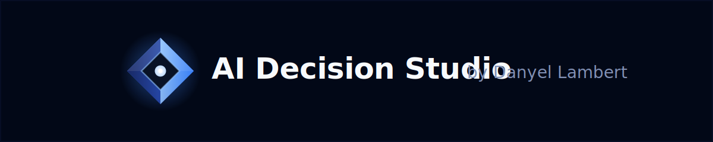
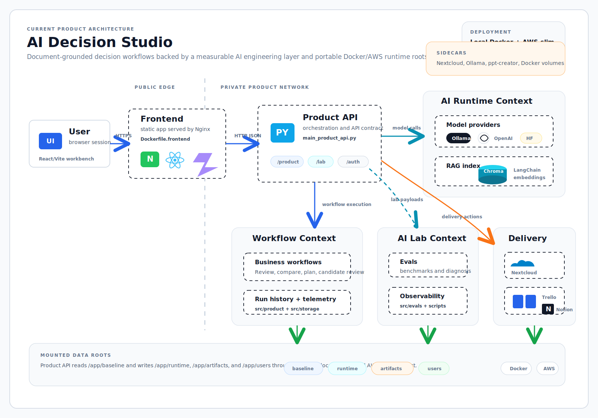

<p align="center">
  
</p>

<p align="center">
  
  
  
  
  
  
  <a href="LICENSE">
    
  </a>
</p>

**Private AI decision intelligence for document-heavy workflows.**

> **Name note:** Axiovance blends **axiom** — a clear principle — with **avance/advance** — forward movement. The product is built around that idea: using grounded evidence to move document-heavy work toward reviewable decisions and execution.

Axiovance is a local-first applied AI product for document-grounded decision workflows. It turns source documents into reviewable findings, action plans, candidate assessments, run history, and executive artifacts, while keeping the underlying AI system measurable through benchmarks, evals, runtime controls, and observability.

The current product is the React/Vite frontend backed by `main_product_api.py`, Docker Compose services, and a versioned runtime payload. Historical Streamlit, Gradio, heavy dependency, and Oracle-specific paths are preserved under `legacy/` so the active product contract stays small and readable.

<!-- HERO_MEDIA_SLOT: Add docs/assets/product/hero-workflow-run.gif here. Recommended capture: landing page, guided tour, Nextcloud import, Document Review, evidence-backed output, and Deck Center artifact generation. -->

## Contents

- [Product Thesis](#product-thesis)
- [What The Product Does](#what-the-product-does)
- [Workflow Surface](#workflow-surface)
- [Architecture](#architecture)
- [Runtime Topology](#runtime-topology)
- [Integrations](#integrations)
- [AI Engineering Lab](#ai-engineering-lab)
- [Technology Stack](#technology-stack)
- [Repository Map](#repository-map)
- [Quickstart](#quickstart)
- [Validation](#validation)
- [API Surface](#api-surface)
- [Documentation Map](#documentation-map)
- [Visual Capture Slots](#visual-capture-slots)
- [License](#license)

## Product Thesis

Most document AI tools stop at chat. Axiovance is built around a different shape:

- documents become grounded working context;
- workflows turn that context into decision artifacts;
- delivery actions send outputs to operational tools;
- the AI Lab measures model, retrieval, and runtime behavior;
- deployment contracts keep the same product usable locally, in Docker, and on AWS.

The repository is organized around two complementary layers.

| Layer | Purpose | Product signal |
| --- | --- | --- |
| Business Workflows | Document-centered workflows for review, comparison, planning, candidate assessment, and artifact generation. | The product solves concrete work instead of exposing a generic prompt box. |
| AI Engineering Lab | Benchmarks, evals, runtime controls, model comparison, observability, and EvidenceOps. | The system records why a workflow behaves the way it does and how it can be improved. |

## What The Product Does

Axiovance combines a document workspace, workflow catalog, AI runtime controls, and artifact delivery layer.

| Area | Capability | Current implementation |
| --- | --- | --- |
| Document workspace | Upload, import, index, preview, delete, and reuse documents as grounded context. | Product API document library, Nextcloud import sheet, RAG state, preindexed fast-import path. |
| Workflow catalog | Run document review, policy comparison, action planning, and candidate review flows. | React workflow pages, Product API workflow contracts, presenters, and stored run history. |
| Evidence-backed outputs | Convert document context into summaries, findings, risks, recommendations, and action items. | Structured Product API responses, workflow history, artifacts, and delivery lineage. |
| Executive artifacts | Generate presentation-ready decks from workflow outputs. | `ppt-creator` sidecar, deck contracts, artifact lifecycle, and export smoke suite. |
| Delivery loop | Publish workflow outputs into operational systems. | Trello and Notion publishing adapters, Nextcloud integration, delivery metadata. |
| Runtime controls | Select and test providers, models, preferences, retrieval behavior, and runtime budget posture. | Preferences page, runtime drawer, provider registry, runtime controls services. |
| AI Lab | Inspect benchmarks, evals, model comparisons, workflow runs, EvidenceOps state, and observability payloads. | AI Lab pages, eval store, benchmark scripts, runtime snapshots, EvidenceOps MCP tooling. |

## Workflow Surface

The frontend is built as a full product shell rather than a single-page demo. The main surfaces are:

| Surface | What it is for | Files to start with |
| --- | --- | --- |
| Landing and guided tour | Product narrative, workflow entry points, and guided walkthrough cards. | `frontend/src/pages/LandingPage.tsx`, `frontend/src/components/landing/`, `frontend/src/components/layout/GuidedWorkbenchTour.tsx` |
| Overview | Product command center and high-level operating context. | `frontend/src/pages/OverviewPage.tsx`, `src/product/command_center.py` |
| Documents | Document library, Nextcloud import, indexing state, and corpus controls. | `frontend/src/pages/DocumentsPage.tsx`, `frontend/src/components/product/NextcloudImportSheet.tsx`, `src/product/ingestion_jobs.py` |
| Document Review | Findings, summaries, risks, grounding, and review-ready outputs. | `frontend/src/pages/DocumentReviewPage.tsx`, `src/product/presenters.py` |
| Policy Comparison | Compare policies or contracts and summarize meaningful differences. | `frontend/src/pages/ComparisonPage.tsx`, `src/product/presenters.py` |
| Action Plan | Turn findings into operational actions and delivery handoffs. | `frontend/src/pages/ActionPlanPage.tsx`, `src/product/action_plan_presenter.py` |
| Candidate Review | Evaluate candidate evidence and produce structured review outputs. | `frontend/src/pages/CandidateReviewPage.tsx`, `src/product/candidate_review_presenter.py` |
| Deck Center | Generate and inspect presentation artifacts. | `frontend/src/pages/DeckCenterPage.tsx`, `src/services/presentation_export_service.py` |
| Run History | Inspect prior workflow runs, reruns, artifacts, and lineage. | `frontend/src/pages/RunHistoryPage.tsx`, `src/storage/product_workflow_history.py` |
| Runtime Controls | Tune active runtime behavior and inspect provider readiness. | `frontend/src/pages/RuntimeControlsPage.tsx`, `src/services/runtime_controls.py` |
| Preferences | Configure connections, credentials, providers, and product preferences. | `frontend/src/pages/PreferencesPage.tsx`, `src/services/preferences.py` |
| AI Lab | Benchmarks, evals, model comparison, observability, chat, workflow inspector, and EvidenceOps. | `frontend/src/pages/LabOverviewPage.tsx`, `frontend/src/pages/BenchmarksPage.tsx`, `frontend/src/pages/EvalsDiagnosisPage.tsx`, `frontend/src/pages/EvidenceOpsPage.tsx`, `src/product/lab.py` |

## Architecture

<p align="center">
  
</p>

The active architecture is a five-service product stack: React/Vite frontend, Product API, `ppt-creator`, Nextcloud, and Ollama. The Product API owns workflow execution, RAG/indexing, AI Lab payloads, integration adapters, runtime controls, and the mounted data contract.

### Runtime data contract

The frontend does not mount product data directly. It talks to the Product API. The Product API owns the mounted data roots:

| Container path | Purpose | Write behavior |
| --- | --- | --- |
| `/app/baseline` | Versioned functional baseline and read-only product payload. | Read-only |
| `/app/runtime` | Active runtime state, caches, logs, RAG stores, integration state, and AI Lab state. | Read/write |
| `/app/artifacts` | Generated decks, exported files, thumbnails, and workflow artifacts. | Read/write |
| `/app/users` | Session/user overlays and public/demo state. | Read/write |

The versioned payload lives under `runtime/ai_decision_studio_functional_baseline/oracle_like_data/`. The directory name is historical; the active Docker contracts are local Docker and AWS.

## Runtime Topology

The Docker product stack runs five services:

| Service | Role |
| --- | --- |
| `frontend` | React/Vite build served by Nginx. |
| `product-api` | Python backend started from `main_product_api.py`. |
| `ppt-creator` | Presentation rendering/export sidecar. |
| `nextcloud` | Document repository sidecar for WebDAV import and EvidenceOps demo material. |
| `ollama` | Local model provider sidecar for local generation and embeddings where enabled. |

The active Compose contracts are intentionally explicit:

| Target | Env file | Compose file | Entrypoint |
| --- | --- | --- | --- |
| Local Docker | `.env.docker` | `docker-compose.local.yml` | `scripts/run_local_docker.sh` |
| AWS | `.env.aws` | `docker-compose.aws.yml` | `scripts/deploy_aws.sh` |
| Local host development | `.env.local` | none | `scripts/run_local_dev.sh` |

AWS uses a single Compose file. It is not layered on top of the local Compose file.

## Integrations

| Integration | What it does | Notes |
| --- | --- | --- |
| Nextcloud | Supplies the document repository used by the import flow and EvidenceOps demo material. | Local Docker and AWS include a Nextcloud sidecar. Golden-baseline restore notes live in `docs/deployment/NEXTCLOUD_GOLDEN_BASELINE_RESTORE.md`. |
| Preindexed import | Activates prebuilt chunks and embeddings for known Nextcloud documents while preserving the normal ingestion UI stages. | Operational notes live in `docs/operations/preindexed-nextcloud-import.md`. |
| Ollama | Provides the local model sidecar. | Local Docker and AWS deploy scripts can pre-pull `embeddinggemma:300m` through `AI_DECISION_STUDIO_OLLAMA_EMBEDDING_MODEL_PULL`. |
| Trello | Publishes workflow outputs to an operational board. | Requires target credentials and list IDs in the selected env file. |
| Notion | Publishes workflow outputs to a database. | Requires a Notion integration token and database ID in the selected env file. |
| OpenAI-compatible APIs | Optional external generation and embedding lanes. | Configured through env/preferences when used. |
| Hugging Face lanes | Optional local/server/inference provider paths. | Setup notes live in `docs/guides/huggingface-provider-setup.md`. |

## AI Engineering Lab

The AI Lab is the engineering layer behind the workflow product. It exists to make runtime behavior observable and repeatable.

| Lab capability | What it tracks | Representative files |
| --- | --- | --- |
| Benchmarks | Retrieval, extraction, embeddings, rerankers, latency, and quality/cost tradeoffs. | `scripts/run_retrieval_extraction_benchmarks.py`, `scripts/run_embedding_benchmark.py`, `docs/assets/phase_4_5/` |
| Evals | Structured-output, workflow, live-provider, and Phase 8 evaluation records. | `evals/`, `src/evals/`, `.github/workflows/phase8-evals.yml` |
| Runtime controls | Provider/model selection, RAG settings, budgets, provider readiness, and preference tests. | `src/services/runtime_controls.py`, `src/services/preferences.py`, `frontend/src/pages/RuntimeControlsPage.tsx` |
| Observability | Runtime snapshots, execution logs, model comparison logs, run history, and artifact lineage. | `src/services/runtime_snapshot.py`, `src/storage/runtime_execution_log.py`, `src/product/telemetry.py` |
| EvidenceOps | Worklog state, action store, repository snapshots, MCP server, and external targets. | `src/services/evidenceops_*`, `src/mcp/`, `scripts/run_evidenceops_mcp_server.py` |
| Deck governance | Deck contracts, routing, artifact lifecycle, quality policy, security notes, and test strategy. | `docs/architecture/executive-deck-generation/` |

## Technology Stack

| Layer | Technologies |
| --- | --- |
| Frontend | React 18, TypeScript 5, Vite 5, Tailwind CSS, React Router, TanStack Query, Radix primitives, Framer Motion, Zustand, Recharts, React Hook Form, Zod, lucide-react, cmdk, Sonner. |
| Product API | Python 3.11, standard-library HTTP server, Pydantic, python-dotenv, local filesystem state, SQLite-backed stores where needed. |
| AI and RAG | Ollama, OpenAI/OpenAI-compatible APIs, Hugging Face provider lanes, LangChain Community, LangChain Chroma, LangChain Text Splitters, LangGraph, ChromaDB, PyPDF, Pillow, NumPy. |
| Artifacts | ppt-creator sidecar, ReportLab, Matplotlib, presentation export services, artifact lineage and generated deck contracts. |
| Operations | Docker Compose, AWS deployment, readiness scripts, smoke checks, deployment bundle builder, backup/restore notes. |
| Quality | Vitest, Playwright, ESLint, Python test gate, readiness checks, benchmark runners, eval workflows. |

The current deployable Python dependency contract is a single lean `requirements.txt`. Older heavyweight dependency sets for Docling, local Transformers, sentence-transformers, and earlier Evidence CV experiments are preserved under `legacy/requirements/`.

## Repository Map

```text
.
|-- frontend/                  # React/Vite product frontend
|-- src/product/               # Product API models, services, presenters, lab payloads
|-- src/rag/                   # Loaders, chunking, retrieval, vector store, LangChain adapter
|-- src/providers/             # Ollama, OpenAI-compatible, and Hugging Face provider registry
|-- src/services/              # Runtime controls, preferences, export, EvidenceOps, snapshots
|-- src/storage/               # Runtime paths, history, eval stores, logs, secret state
|-- src/evals/                 # Evaluation logic and thresholds
|-- src/evidence_cv/           # Historical/current evidence-grounded CV extraction pipeline
|-- src/mcp/                   # EvidenceOps MCP server and JSON-RPC stdio
|-- docs/                      # Product, architecture, deployment, operations, reference docs
|-- evals/                     # Tracked eval fixtures and benchmark configs
|-- scripts/                   # Deployment, readiness, eval, benchmark, and reporting commands
|-- runtime/                   # Versioned functional baseline payload
|-- legacy/                    # Historical Streamlit, Gradio, Oracle, and heavy dependency material
|-- main_product_api.py        # Current backend entrypoint
|-- docker-compose.local.yml   # Local Docker product stack
|-- docker-compose.aws.yml # AWS product stack
|-- Dockerfile.frontend
|-- Dockerfile.product-api.local
|-- Dockerfile.product-api.aws
|-- requirements.txt
|-- ROADMAP.md
`-- README.md
```

## Quickstart

### Prerequisites

- Python 3.11
- Node.js and npm
- Docker with the Compose plugin
- Enough disk for Docker volumes, Nextcloud, Ollama models, and generated artifacts

### 1. Install dependencies

```bash
pip install -r requirements.txt
npm --prefix frontend install
```

### 2. Run local host development

```bash
cp .env.local.example .env.local
ENV_FILE=.env.local scripts/run_local_dev.sh
```

For a non-blocking contract check:

```bash
ENV_FILE=.env.local.example scripts/run_local_dev.sh --check
```

### 3. Run the local Docker product stack

```bash
cp .env.docker.example .env.docker
ENV_FILE=.env.docker scripts/run_local_docker.sh --config-only
ENV_FILE=.env.docker scripts/run_local_docker.sh
```

The local Docker script resolves local data roots, starts the five-service stack, and ensures the configured Ollama embedding model is available unless disabled with `SKIP_OLLAMA_EMBEDDING_MODEL_PULL=1`.

### 4. Deploy the AWS stack

Use the AWS runbooks for a fresh host or redeploy:

- `docs/deployment/AWS_FRESH_EC2_BOOTSTRAP.md`
- `docs/deployment/aws-deploy.md`
- `docs/deployment/REDEPLOY_FAST_PATH.md`
- `docs/deployment/MULTI_ENVIRONMENT_CONTRACT.md`

The operational contract is:

```bash
cp .env.aws.example .env.aws
scripts/deploy_aws.sh
scripts/smoke_aws.sh
```

Run those commands on the prepared deployment host after the bundle and env file are in place.

## Validation

The fastest current confidence path is:

```bash
npm --prefix frontend run test
npm --prefix frontend run build
scripts/run_current_test_gate.sh
scripts/readiness_multi_environment_contract_check.sh
ENV_FILE=.env.docker.example scripts/run_local_docker.sh --config-only
docker compose --env-file .env.aws.example -p ai-decision-studio-contract-aws -f docker-compose.aws.yml config
```

Additional focused checks are available for AWS env contracts, Nextcloud golden baseline assumptions, required integrations, required providers, AI Lab content, EvidenceOps cache, Candidate Review, presentation export, and frontend surface parity. See `scripts/README.md` for the complete catalog.

### CI workflows

| Workflow | File | Purpose |
| --- | --- | --- |
| Product CI | `.github/workflows/product-ci.yml` | Validates the current Product API, frontend test/build path, and Docker/AWS compose contracts. |
| Phase 8 evals | `.github/workflows/phase8-evals.yml` | Runs tracked evaluation fixtures without live provider dependencies. |
| Phase 8 live evals | `.github/workflows/phase8-evals-live.yml` | Preserves the live-provider eval lane for intentional provider-backed runs. |

## API Surface

The active Product API is intentionally workflow-oriented. The most important routes are:

| Route | Purpose |
| --- | --- |
| `GET /health` | Service health. |
| `GET /api/product/workflows` | Workflow catalog contract. |
| `GET /api/product/documents` | Indexed document catalog. |
| `GET /api/product/document-library` | Aggregated document library payload. |
| `POST /api/product/upload-documents` | Upload and index documents into the product corpus. |
| `POST /api/product/delete-documents` | Remove indexed documents. |
| `GET /api/product/command-center` | Aggregated command-center payload. |
| `GET /api/product/run-history` | Recent workflow execution history. |
| `GET /api/product/artifacts` | Recent generated artifacts. |
| `GET /api/product/grounding-preview` | Grounded context preview. |
| `POST /api/product/run-workflow` | Execute a product workflow. |
| `POST /api/product/generate-deck` | Generate a workflow executive deck. |
| `POST /api/product/publish-to-trello` | Publish workflow output to Trello. |
| `POST /api/product/publish-to-notion` | Publish workflow output to Notion. |
| `GET /api/lab/overview` | AI Lab overview payload. |
| `GET /api/lab/runtime` | Runtime observability payload. |
| `GET /api/lab/benchmarks` | Benchmark payloads. |
| `GET /api/lab/evals` | Eval diagnosis payloads. |
| `GET /api/lab/evidenceops` | EvidenceOps state. |
| `GET /api/runtime/controls` | Runtime controls payload. |
| `GET /api/preferences` | Preferences and connection configuration payload. |

## Documentation Map

| Topic | Start here |
| --- | --- |
| Product overview | `docs/product/overview.md` |
| Product vs AI Lab framing | `docs/product/two-track-positioning.md` |
| Current product surface | `docs/architecture/current-product-surface.md` |
| Data payload and mounted roots | `docs/architecture/data-payload.md` |
| Local Docker | `docs/deployment/local-docker-compose.md` |
| AWS deployment | `docs/deployment/aws-deploy.md` |
| Fresh AWS EC2 bootstrap | `docs/deployment/AWS_FRESH_EC2_BOOTSTRAP.md` |
| Multi-environment contract | `docs/deployment/MULTI_ENVIRONMENT_CONTRACT.md` |
| Python dependency contract | `docs/deployment/python-dependencies.md` |
| Nextcloud golden baseline | `docs/deployment/NEXTCLOUD_GOLDEN_BASELINE_RESTORE.md` |
| Preindexed Nextcloud import | `docs/operations/preindexed-nextcloud-import.md` |
| Backup and restore | `docs/operations/backup-and-restore.md` |
| Executive deck generation | `docs/architecture/executive-deck-generation/README.md` |
| EvidenceOps architecture | `docs/architecture/evidenceops/README.md` |
| Evals and benchmarks | `docs/architecture/evals/README.md` |
| Script catalog | `scripts/README.md` |
| Eval workspace | `evals/README.md` |
| Project chronology | `ROADMAP.md` |

## Visual Capture Slots

Recommended product media assets:

| Slot | Suggested path | Recommended capture |
| --- | --- | --- |
| Hero workflow GIF | `docs/assets/product/hero-workflow-run.gif` | Landing page, guided tour, document import, Document Review run, generated evidence output, and Deck Center artifact. |
| Product shell screenshot | `docs/assets/product/product-shell.png` | Sidebar, command palette or runtime drawer, and the main workbench layout. |
| Document Review screenshot | `docs/assets/product/document-review.png` | Grounded findings, risks, recommendations, and source context. |
| Policy Comparison screenshot | `docs/assets/product/policy-comparison.png` | Difference summary, impact notes, and evidence-backed findings. |
| Action Plan screenshot | `docs/assets/product/action-plan.png` | Action items, owners/status language, and publish controls. |
| Candidate Review screenshot | `docs/assets/product/candidate-review.png` | Candidate signal, evidence, strengths, gaps, and recommendation output. |
| Nextcloud import GIF | `docs/assets/product/nextcloud-import.gif` | Import from Nextcloud, staged ingestion progress, and indexed document appearing in the library. |
| Deck generation GIF | `docs/assets/product/deck-generation.gif` | Generate deck, artifact appears, preview/download path. |
| AI Lab screenshot | `docs/assets/product/ai-lab-overview.png` | Benchmark/eval summary, runtime controls, and observability cards. |
| Integration screenshots | `docs/assets/product/trello-notion-delivery.png` | Published Trello card and Notion database entry generated from a workflow output. |

## License

This project is released under the [MIT License](LICENSE).
