# Phase 4.5 Benchmark Results

## Scope

Phase 4.5 closed with four benchmark tracks executed on the same corpus and then consolidated into a single recommended default configuration for the project:

1. PDF extraction benchmark
2. Embedding model benchmark
3. Embedding context window benchmark
4. Retrieval tuning benchmark

The benchmark corpus was fixed across the suite:

- `2025-HB-44-20250106-Final-508.pdf`
- `kaur-2016-ijca-911367.pdf`
- `Meng_Extraction_of_Virtual_ICCV_2015_paper.pdf`
- `c9c938dc-08e0-4f18-bf1d-a5d513c93ed8.pdf`

The final decision was made by **quality/cost trade-off analysis**, not by raw score alone.

---

## Reproducibility

### Source data

All chart-ready benchmark data used in this document is versioned in:

```text
docs/data/phase_4_5_benchmark_data.json
```

### Render charts

```bash
python scripts/render_phase_4_5_charts.py
```

Generated assets are written to:

```text
docs/assets/phase_4_5/
```

---

## Metrics used

### PDF extraction benchmark

- `manual_score` on a 0–2 scale
- normalized quality percentage
- extraction time
- indexing time
- manual-review coverage

### Retrieval-oriented benchmarks

- `Hit@1`
- `Hit@K`
- `MRR`
- `avg_retrieval_seconds`
- `p95_retrieval_seconds`
- `indexing_seconds`

---

## Executive decision

Recommended project configuration after Phase 4.5:

```env
OLLAMA_EMBEDDING_MODEL=embeddinggemma:300m
OLLAMA_EMBEDDING_CONTEXT_WINDOW=512
RAG_CHUNK_SIZE=1200
RAG_CHUNK_OVERLAP=80
RAG_TOP_K=4
RAG_RERANK_POOL_SIZE=8
RAG_PDF_EXTRACTION_MODE=hybrid
```

### Winner matrix


### Final recommended configuration


### Cost/quality decision summary


---

## 1) PDF extraction benchmark

### Manual-review coverage

- 12 review packets
- 192 manual judgments
- score scale: `0` = unsupported/incorrect, `1` = partially correct, `2` = well supported/correct

### Aggregate results by mode

| Mode | Avg manual score | Normalized quality | Avg extraction (s) | Avg indexing (s) |
| --- | ---: | ---: | ---: | ---: |
| `basic` | 1.0938 | 54.7% | 2.7385 | 40.6925 |
| `hybrid` | 1.0625 | 53.1% | 22.0248 | 40.8867 |
| `complete` | 1.1094 | 55.5% | 1485.3800 | 127.1430 |

### Visuals

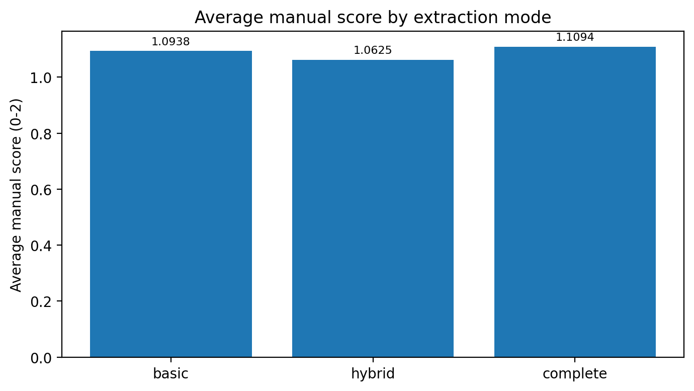


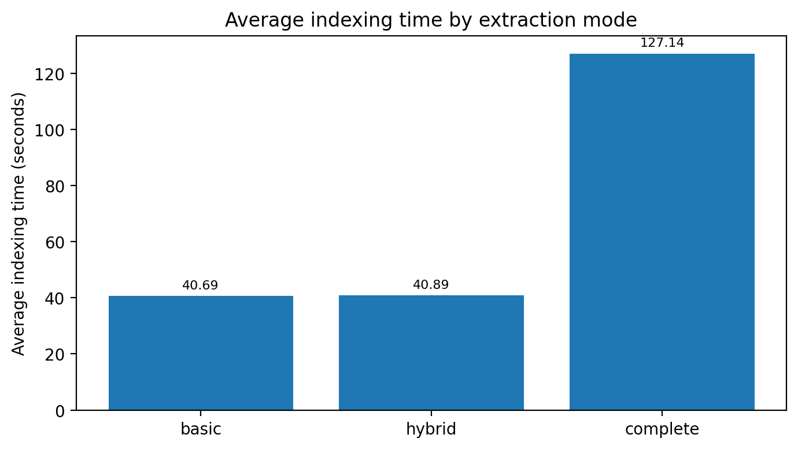

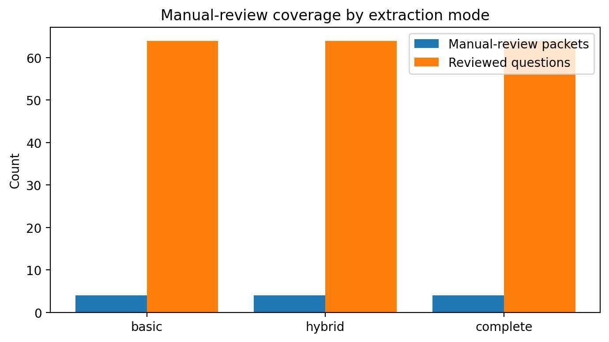

### Document-level results

| Document | `basic` | `hybrid` | `complete` | Winner |
| --- | ---: | ---: | ---: | --- |
| `2025-HB-44-20250106-Final-508.pdf` | 0.8750 | 0.9375 | 0.7500 | `hybrid` |
| `kaur-2016-ijca-911367.pdf` | 1.2500 | 1.1875 | 1.1875 | `basic` |
| `Meng_Extraction_of_Virtual_ICCV_2015_paper.pdf` | 1.1250 | 0.9375 | 1.2500 | `complete` |
| `c9c938dc-08e0-4f18-bf1d-a5d513c93ed8.pdf` | 1.1250 | 1.1875 | 1.2500 | `complete` |

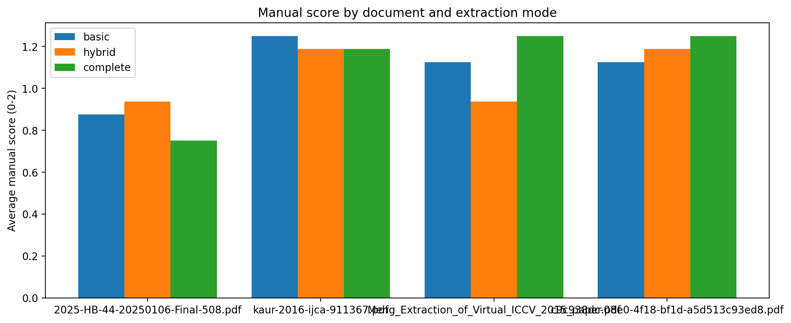

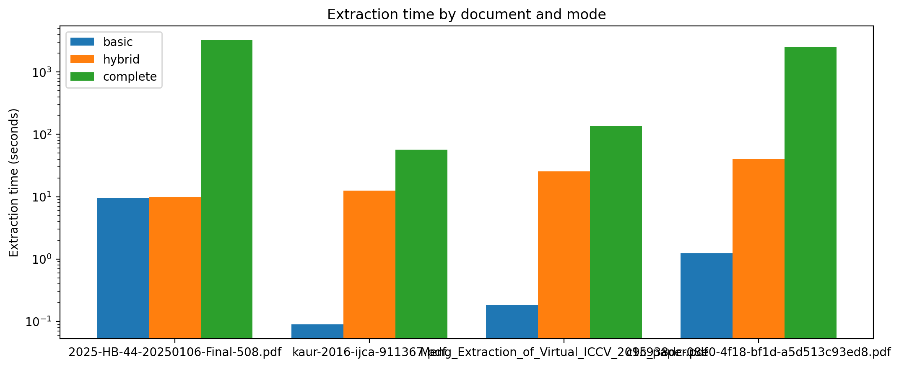

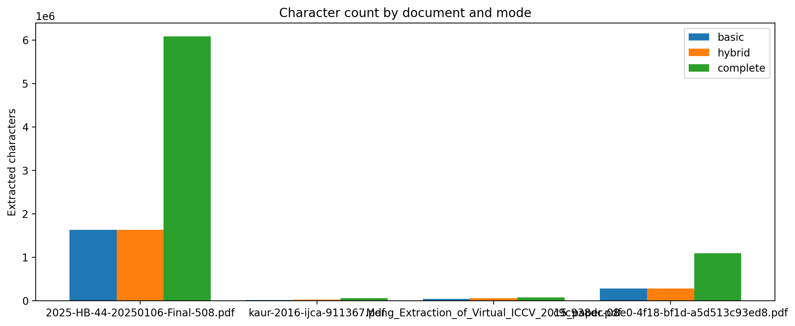

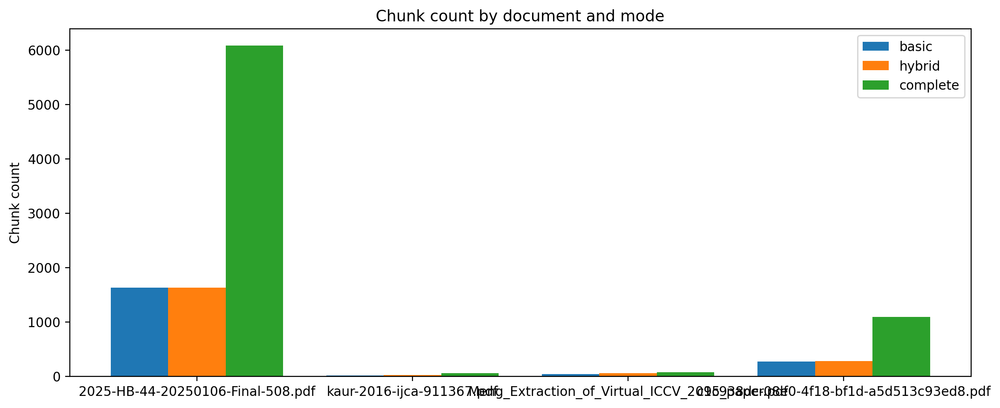

### Interpretation

- `complete` reached the best aggregate manual score, but only by a **very small** margin.
- `complete` was **orders of magnitude slower** than `basic` and far slower than `hybrid`.
- The winner changes by document, which means extraction mode is a **document-dependent** choice rather than a universal ranking.
- `hybrid` is the strongest engineering default because it stays in the same general quality band while avoiding the cost explosion of `complete`.

### Decision

- **Default mode:** `hybrid`
- **Fast baseline / sanity check:** `basic`
- **Escalation mode for OCR-heavy or highly visual PDFs:** `complete`

---

## 2) Embedding model benchmark

### Final ranking

| Rank | Model | Hit@1 | Hit@K | MRR | Avg retrieval (s) | P95 retrieval (s) | Indexing (s) |
| --- | --- | ---: | ---: | ---: | ---: | ---: | ---: |
| 1 | `embeddinggemma:300m` | 1.0000 | 1.0000 | 1.0000 | 0.7259 | 0.7197 | 161.3099 |
| 2 | `bge-m3:latest` | 1.0000 | 1.0000 | 1.0000 | 0.8975 | 0.9118 | 163.7095 |
| 3 | `qwen3-embedding:4b` | 1.0000 | 1.0000 | 1.0000 | 2.1876 | 2.2019 | 1767.7592 |
| 4 | `nomic-embed-text-v2-moe:latest` | 0.8750 | 1.0000 | 0.9167 | 0.7265 | 0.7250 | 77.1035 |
| 5 | `qwen3-embedding:0.6b` | 0.7500 | 0.8750 | 0.8125 | 0.8700 | 0.8865 | 270.8905 |

### Visuals


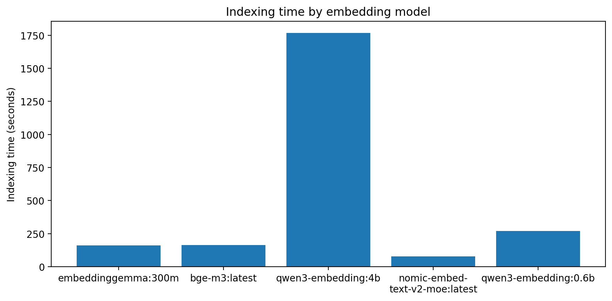

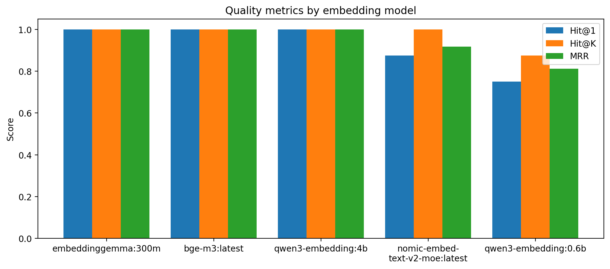

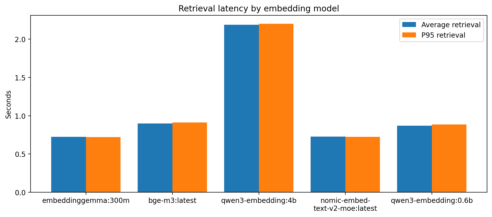

### Interpretation

- `embeddinggemma:300m` delivered **perfect retrieval quality** with the best speed/quality trade-off.
- `bge-m3:latest` also achieved perfect quality, but was slower.
- `qwen3-embedding:4b` matched quality but was prohibitively expensive for this project.
- `nomic-embed-text-v2-moe:latest` was fast to index, but missed quality targets.
- `qwen3-embedding:0.6b` was the weakest option on retrieval quality.

### Decision

Use `embeddinggemma:300m` as the default embedding model.

---

## 3) Embedding context window benchmark

### Winner

| Winner | Hit@1 | Hit@K | MRR | Avg retrieval (s) | P95 retrieval (s) | Indexing (s) |
| --- | ---: | ---: | ---: | ---: | ---: | ---: |
| `embeddinggemma:300m` + `512` | 1.0000 | 1.0000 | 1.0000 | 0.6932 | 0.6987 | 166.8564 |

### Key comparison points

| Case | Hit@1 | Hit@K | MRR | Avg retrieval (s) | Indexing (s) | Takeaway |
| --- | ---: | ---: | ---: | ---: | ---: | --- |
| `embeddinggemma:300m` + `256` | 1.0000 | 1.0000 | 1.0000 | 0.7000 | 201.6232 | same quality, worse indexing |
| `embeddinggemma:300m` + `1024` | 1.0000 | 1.0000 | 1.0000 | 0.7046 | 160.0498 | near-tie, slightly slower retrieval |
| `embeddinggemma:300m` + `2048` | 1.0000 | 1.0000 | 1.0000 | 0.7152 | 159.5007 | still strong, but slower retrieval |
| `qwen3-embedding:4b` + `40960` | 1.0000 | 1.0000 | 1.0000 | 6.6912 | 2336.1700 | perfect quality, impractical throughput |

### Visuals


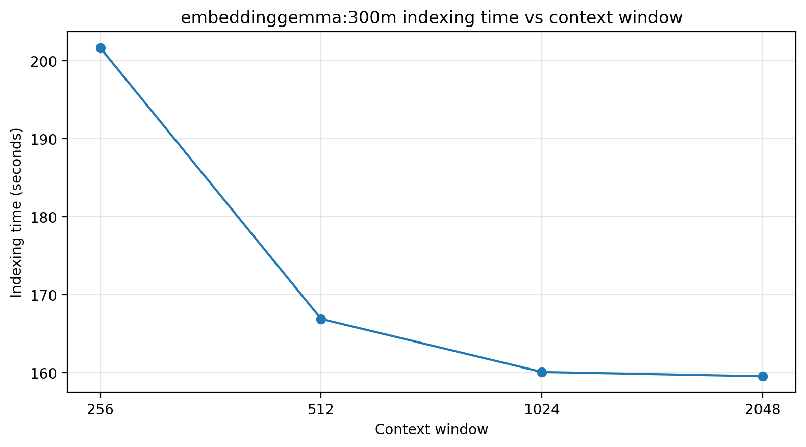

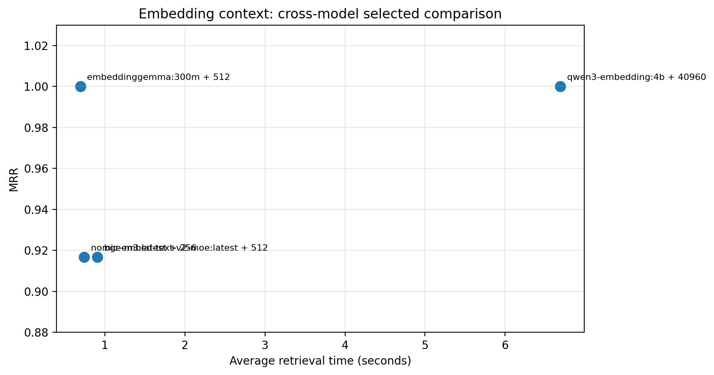

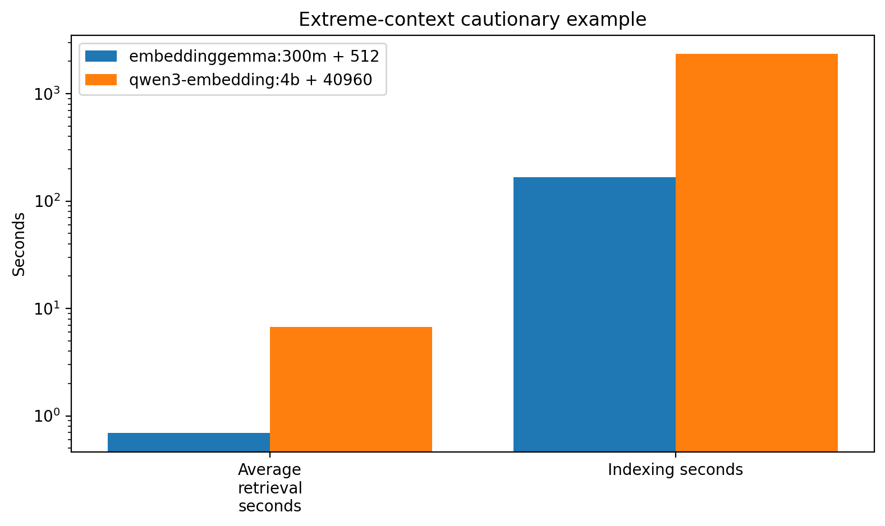

### Interpretation

- In the winning model track, all tested context windows preserved perfect quality.
- `512` had the best retrieval latency inside that track.
- `256` carried a clear indexing penalty.
- Very large context windows can preserve quality while **severely harming throughput**.

### Decision

Use `embedding_context_window = 512` as the default for `embeddinggemma:300m`.

---

## 4) Retrieval tuning benchmark

### Final ranking snapshot

| Label | Hit@1 | Hit@K | MRR | Avg retrieval (s) | Indexing (s) | Chunk size | Overlap | Top-k | Rerank pool |
| --- | ---: | ---: | ---: | ---: | ---: | ---: | ---: | ---: | ---: |
| `lower_overlap` | 1.0000 | 1.0000 | 1.0000 | 0.8449 | 143.9370 | 1200 | 80 | 4 | 8 |
| `baseline` | 1.0000 | 1.0000 | 1.0000 | 0.9102 | 161.7390 | 1200 | 200 | 4 | 8 |
| `higher_top_k` | 1.0000 | 1.0000 | 1.0000 | 0.9178 | 161.4860 | 1200 | 200 | 6 | 12 |
| `smaller_chunks` | 1.0000 | 1.0000 | 1.0000 | 1.2441 | 171.9050 | 800 | 120 | 4 | 8 |
| `lighter_rerank_pool` | 0.8750 | 1.0000 | 0.9167 | 0.8986 | 162.3800 | 1200 | 200 | 4 | 4 |
| `larger_chunks` | 0.8750 | 0.8750 | 0.8750 | 0.7131 | 155.4390 | 1600 | 200 | 4 | 8 |

### Visuals


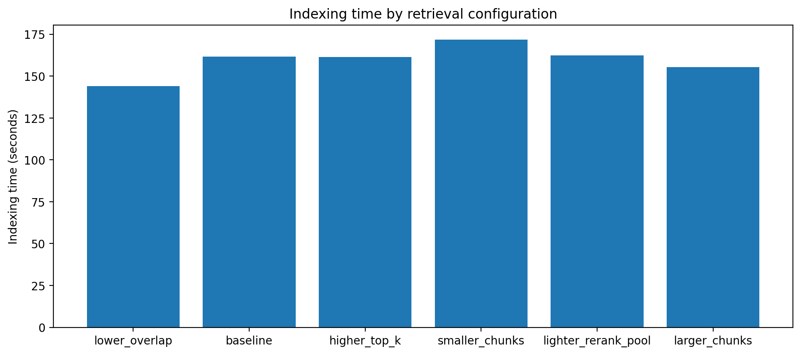

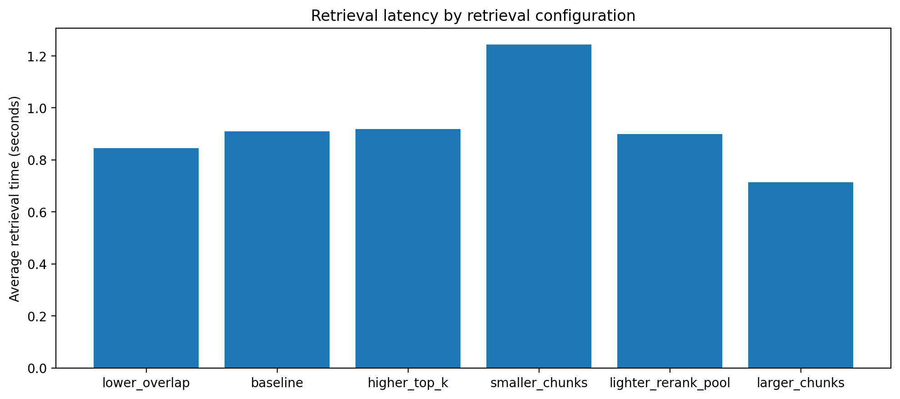

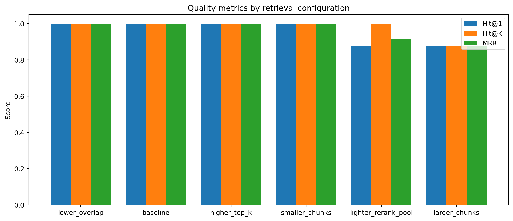

### Interpretation

- `lower_overlap` is the best Pareto-style point among the perfect-quality runs.
- Reducing overlap from `200` to `80` preserved perfect quality and reduced both retrieval and indexing cost.
- Increasing `top_k` and rerank pool did not improve quality on this corpus.
- `larger_chunks` was the fastest, but quality fell too much to justify using it as default.

### Decision

Use `chunk_overlap = 80` with the validated configuration:

```env
RAG_CHUNK_SIZE=1200
RAG_CHUNK_OVERLAP=80
RAG_TOP_K=4
RAG_RERANK_POOL_SIZE=8
```

---

## Final recommendation

### Final defaults selected from the benchmark suite

```env
OLLAMA_EMBEDDING_MODEL=embeddinggemma:300m
OLLAMA_EMBEDDING_CONTEXT_WINDOW=512
RAG_CHUNK_SIZE=1200
RAG_CHUNK_OVERLAP=80
RAG_TOP_K=4
RAG_RERANK_POOL_SIZE=8
RAG_PDF_EXTRACTION_MODE=hybrid
```

### Why this closes Phase 4.5

Phase 4.5 is complete because the project now has:

- benchmarked ingestion modes
- benchmarked embedding selection
- benchmarked embedding context tuning
- benchmarked retrieval tuning
- manual validation for extraction quality
- versioned chart data
- re-renderable visual evidence
- documented defaults justified by measured trade-offs

This turns the system into a **benchmarked and defensible baseline**, not just a functional RAG demo.
