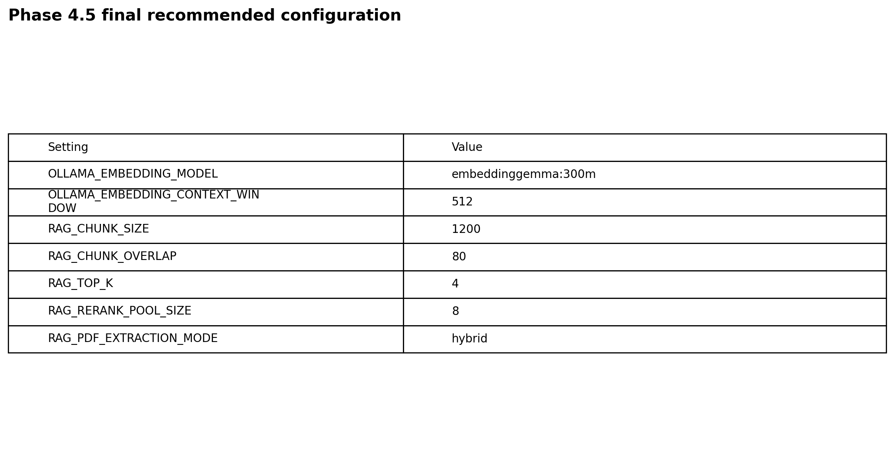
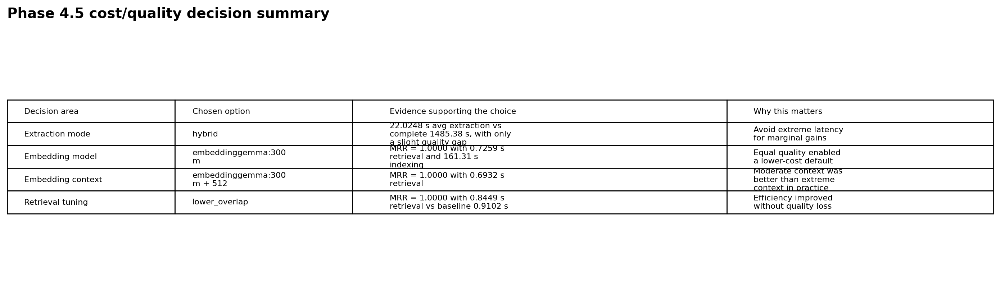

# Phase 4.5 Validation

## Objective

Phase 4.5 was the transition from a merely functional RAG pipeline to a **benchmarked, explainable, and operationally defensible** baseline.

The validation goal was not limited to “does the app answer questions?”. It explicitly covered:

- ingestion robustness
- embedding selection
- embedding context-window tuning
- retrieval tuning
- human review of extraction outputs
- operational observability
- reproducible benchmark documentation

---

## Validation components completed

### 1) PDF extraction benchmark with human review

Completed:
- benchmark execution for `basic`, `hybrid`, and `complete`
- manual review split into 12 packets
- 192 total manual judgments
- aggregate and document-level consolidation
- visual summary generated and versioned

Key outcome:
- `hybrid` selected as project default
- `basic` retained as fast baseline
- `complete` retained as escalation mode

Reference docs:
- `docs/BENCHMARK_PDF_EXTRACTION_EN.md`
- `docs/PHASE_4_5_BENCHMARK_RESULTS.md`

Key visuals:
- `docs/assets/phase_4_5/02_pdf_extraction_aggregate_quality_vs_cost.png`
- `docs/assets/phase_4_5/05_pdf_extraction_doc_level_manual_score.png`

---

### 2) Embedding model benchmark

Completed:
- same corpus and fixed question set
- quality comparison with `Hit@1`, `Hit@K`, `MRR`
- retrieval latency comparison
- indexing-cost comparison
- visual summary generated and versioned

Key outcome:
- `embeddinggemma:300m` selected as default embedding model

Key visuals:
- `docs/assets/phase_4_5/09_embedding_models_quality_vs_latency.png`
- `docs/assets/phase_4_5/10_embedding_models_indexing_time.png`

---

### 3) Embedding context window benchmark

Completed:
- explicit benchmark of `embedding_context_window`
- validated that context size is a real tuning axis
- compared moderate and extreme windows
- visual summary generated and versioned

Key outcome:
- `embeddinggemma:300m + 512` selected as the practical default

Key visuals:
- `docs/assets/phase_4_5/13_embedding_ctx_retrieval_vs_window.png`
- `docs/assets/phase_4_5/16_embedding_ctx_extreme_context_warning.png`

---

### 4) Retrieval tuning benchmark

Completed:
- benchmarked `chunk_size`
- benchmarked `chunk_overlap`
- benchmarked `top_k`
- benchmarked `rerank_pool_size`
- compared baseline vs tuned variants
- visual summary generated and versioned

Key outcome:
- `lower_overlap` selected as the final retrieval configuration

Key visuals:
- `docs/assets/phase_4_5/17_retrieval_tuning_quality_vs_latency.png`
- `docs/assets/phase_4_5/20_retrieval_tuning_quality_metrics.png`

---

## Final recommended configuration

```env
OLLAMA_EMBEDDING_MODEL=embeddinggemma:300m
OLLAMA_EMBEDDING_CONTEXT_WINDOW=512
RAG_CHUNK_SIZE=1200
RAG_CHUNK_OVERLAP=80
RAG_TOP_K=4
RAG_RERANK_POOL_SIZE=8
RAG_PDF_EXTRACTION_MODE=hybrid
```

Executive visuals:






---

## Reproducibility

### Benchmark data

```text
docs/data/phase_4_5_benchmark_data.json
```

### Regenerate charts

```bash
python scripts/render_phase_4_5_charts.py
```

### Validate syntax after documentation changes

```bash
python -m compileall src scripts
```

---

## Why Phase 4.5 is considered complete

Phase 4.5 is considered complete because the project now has all of the following simultaneously:

- a persistent and observable RAG pipeline
- explicit embedding compatibility handling
- explicit embedding context-window handling
- practical retrieval tuning backed by measured evidence
- PDF extraction benchmark with human review
- consolidated numerical results
- versioned chart assets
- a chart-rendering script that reproduces the visual evidence
- documented defaults justified by measured trade-offs

That is enough to move the project from a functional prototype to a **benchmarked baseline** with reproducible evidence and explicit engineering trade-offs.
